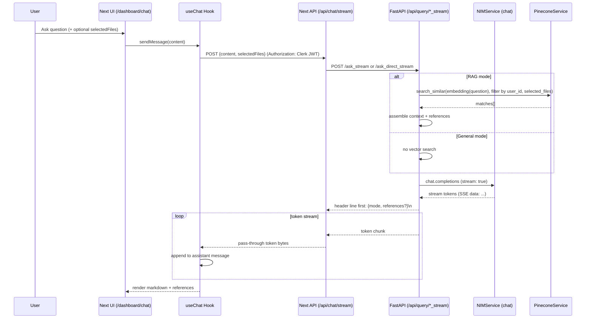

# NeuroSpace – Technical Architecture & Workflow (for Agents)

This document provides technical, implementation-level details with system diagrams so agents and services can reason about the app end-to-end.

- Frontend: Next.js 15 (App Router), React 19, TypeScript, Tailwind, Framer Motion
- Backend: FastAPI (Python), service layer (S3, Supabase, Pinecone, NVIDIA NIM)
- AuthN/Z: Clerk JWT (frontend), user verification + optional backend key (backend)
- Data: S3 (objects), Supabase (metadata), Pinecone (vectors)
- AI: NVIDIA NIM – `nv-embedqa-e5-v5` (embeddings), `llama-3.3-nemotron-super-49b-v1.5` (chat)


## 1) System Context Diagram

```mermaid
flowchart LR
  subgraph Client[Browser]
    U[User]
  end

  subgraph FE[Next.js App]
    UI[UI Pages / Dashboard]
    API1[/api/upload/]
    API2[/api/process/]
    API3[/api/files/]
    API4[/api/chat/stream/]
  end

  subgraph BE[FastAPI Backend]
    R1[/api/processing/process/]
    R2[/api/query/ask(_stream)/]
    R3[/api/query/ask_direct(_stream)/]
    R4[/api/files/*/]
  end

  subgraph Services[Internal Services]
    S3S[S3Service]
    TX[TextExtractor]
    NIM[NIMService]
    PC[PineconeService]
    SB[SupabaseService]
  end

  subgraph Ext[External Providers]
    S3[(AWS S3)]
    SUP[(Supabase Postgres)]
    PIN[(Pinecone Vector DB)]
    NVCF[(NVIDIA NIM API)]
    CLERK[(Clerk Auth)]
  end

  U --> UI
  UI -->|auth| CLERK
  UI --> API1
  UI --> API2
  UI --> API3
  UI --> API4

  API1 -->|JWT + env creds| S3
  API2 -->|JWT| R1
  API3 -->|JWT| R4
  API4 -->|JWT| R2 & R3

  R1 --> S3S --> S3
  R1 --> TX
  R1 --> NIM --> NVCF
  R1 --> PC --> PIN
  R1 --> SB --> SUP

  R2 --> NIM --> NVCF
  R2 --> PC --> PIN

  R3 --> NIM --> NVCF
```


## 2) Upload Pipeline – Sequence

```mermaid
sequenceDiagram
  participant U as User
  participant UI as Next UI (/dashboard/upload)
  participant N1 as Next API (/api/upload)
  participant S3 as AWS S3 (PUT URL)
  participant N2 as Next API (/api/process)
  participant F as FastAPI (/api/processing/process)
  participant S3S as S3Service
  participant TX as TextExtractor
  participant NIM as NIMService (embeddings)
  participant PC as PineconeService
  participant SB as SupabaseService

  U->>UI: Drop/select file
  UI->>N1: POST {fileName, fileType, fileSize}
  N1->>N1: Validate type/ext/size; build fileKey
  N1->>S3: Create pre-signed PUT URL
  N1-->>UI: {url, fileKey}
  UI->>S3: PUT file (direct upload)
  UI->>N2: POST {fileKey, fileName, fileSize, fileType}
  N2->>F: Forward with Authorization: Bearer <JWT>
  F->>S3S: get_file_size(fileKey)
  S3S->>S3: HEAD object
  S3-->>S3S: size
  F->>S3S: download_file(fileKey)
  S3S->>S3: GET object
  S3-->>S3S: file bytes (temp path)
  F->>TX: extract_text(temp_path, content_type)
  TX-->>F: text
  F->>F: chunk_text(text) + limits
  F->>NIM: batch embeddings(chunks)
  NIM->>NIM: retries/backoff on 429/5xx/timeouts
  NIM-->>F: 1024-dim vectors[]
  F->>PC: upsert(vectors with metadata)
  PC->>PC: coordinate dims
  F->>SB: update status: processed, chunks_count, size
  F-->>N2: {job_id, status: completed}
  N2-->>UI: success
```


## 3) Chat & Streaming – Sequence




## 4) API Contracts (Key Endpoints)

All requests to FastAPI must include:
- `Authorization: Bearer <Clerk JWT>`
- Optional: `X-Backend-Key: <key>` if configured

Next.js APIs (frontend):

- POST `/api/upload`
  - Request: `{ fileName: string; fileType: string; fileSize: number }`
  - Response: `{ url: string; fileKey: string; fileName: string; success: true }`
  - Errors: `400` invalid input; `500` AWS env config or presign failure

- POST `/api/process`
  - Request: `{ fileKey, fileName, fileSize, fileType }`
  - Response: `{ success: true, jobId: string, message: string }`
  - Proxies to FastAPI `/api/processing/process`

- POST `/api/chat/stream`
  - Request: `{ content: string; topK?: number; selectedFiles?: string[] }`
  - Response: streaming text/plain
    - First line: JSON header `{ mode: "document" | "general", references?: Array<{file_name, score?, file_key?, chunk_index?}> }` followed by newline
    - Subsequent chunks: raw UTF-8 tokens
  - Errors: `401/403` auth; `408` timeout; `429` rate limit; `5xx` backend

FastAPI (backend):

- POST `/api/processing/process`
  - Request: `{ file_key, file_name, user_id, file_size, content_type }`
  - Response: `{ job_id, status: "completed", message, file_key }`

- POST `/api/query/ask_stream`
  - Request: `{ user_id: string; question: string; top_k?: number; selected_files?: string[] }`
  - Response: streaming text
    - First line header as described above

- POST `/api/query/ask_direct_stream`
  - Same as above, but no RAG; returns `{ mode: "general" }` header

- GET `/api/query/health`
  - Returns status of NIM/Pinecone and overall


## 5) Data Models & Storage Conventions

- S3 object key: `uploads/{userId}/{uuid}.{ext}`
  - Security: key prefix must match `uploads/{userId}/`; filename must match `[a-zA-Z0-9\-_.]+`

- Supabase `files` table (representative):
  - `id: uuid`
  - `user_id: text`
  - `file_key: text`
  - `file_name: text`
  - `file_size: bigint`
  - `content_type: text`
  - `status: text` (pending|processing|processed)
  - `chunks_count: int`
  - `created_at`, `updated_at`

- Pinecone vector metadata (per chunk):
  - `file_key: string`
  - `file_name: string`
  - `user_id: string`
  - `chunk_index: number`
  - `text: string (<=500 chars preview)`
  - `content_type: string`


## 6) Limits, Timeouts, Retries (as-coded)

- Upload size:
  - UI accept: 50MB (Upload page)
  - Next `/api/upload`: 10MB max (enforced) ← Note mismatch with UI; align as needed
- Extraction safeguards:
  - Max extracted text: ~10MB
  - Max chunks: 1000
- NIM Embeddings:
  - Endpoint: `POST {base}/embeddings`
  - Timeouts: connect=10s, read=30s; retries with backoff for 429/5xx/timeouts
- NIM Chat (non-stream): timeout 60s
- NIM Chat (stream): connect=15s, read=120s; retries with backoff on 429/5xx/timeouts
- Next `/api/chat/stream`: global timeout 180s; retries (max 2) on 429/5xx with exponential backoff


## 7) Security Model

- Frontend: Clerk middleware (`src/middleware.ts`) protects all non-public routes
- Backend: `get_verified_user` checks JWT; `require_backend_key` for extra trust boundary
- CORS: `FRONTEND_ORIGIN` allowed only; credentials allowed
- Headers: adds `X-Content-Type-Options=nosniff`, `X-Frame-Options=DENY`, `Referrer-Policy=no-referrer`, `Permissions-Policy`
- Upload: strict file extension + MIME allowlist; key prefix + filename regex; name length
- DoS Safety: chunk/text limits, batch sizing, retries with backoff, bounded concurrency
- Secrets: all read from environment; validation on startup


## 8) Observability & Health

- Backend `/health` (root) – API health
- Backend `/api/query/health` – NIM + Pinecone health and expected embedding dimension
- Logging: pipeline stages, errors, and timing (embed/search/answer durations)


## 9) Idempotency & Consistency Notes

- Processing is triggered per upload; current flow assumes at-most-once invocation from UI
- Consider an idempotency key per `{user_id,file_key}` to dedupe if frontends retry
- Supabase record is updated if found, created otherwise (fallback path)
- Pinecone upsert is idempotent on vector IDs (e.g., `{file_key}_chunk_{i}`)


## 10) Known Gaps / TODOs for Agents

- Align upload size limit (UI 50MB vs API 10MB)
- Implement job status tracking (`/api/processing/status/{job_id}`)
- Consider a queue (e.g., Celery/RQ/Sidekiq-like) for large-scale processing
- Add circuit breakers around NIM/Pinecone
- Structured logging + trace IDs across FE→BE→Services


## 11) Streaming Contract (Wire-Level)

- Content-Type: `text/plain; charset=utf-8`
- Line 1: JSON header, single line, terminated with `\n`
  - RAG: `{ "mode": "document", "references": [{"file_name":"...","file_key":"...","score":0.87,"chunk_index":12}] }\n`
  - General: `{ "mode": "general" }\n`
- Following bytes: raw UTF-8 text tokens, no sentinel required (connection close marks end)
- Client abort: frontend issues `AbortController.abort()`; server cleans up reader and closes stream

